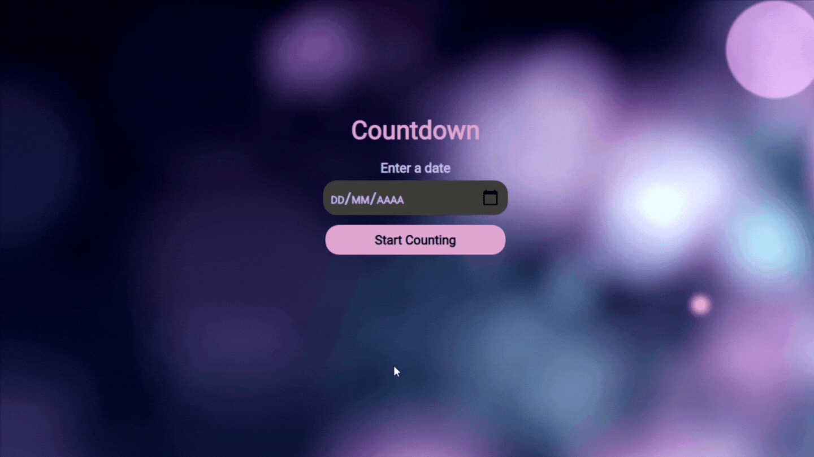

<h1 align="center">
  Countdown
</h1>

  <a href="#-tecnologias">Tecnologias</a>&nbsp;&nbsp;&nbsp;|&nbsp;&nbsp;&nbsp;
  <a href="#-projeto">Projeto</a>&nbsp;&nbsp;&nbsp;|&nbsp;&nbsp;&nbsp;
  <a href="#-layout">Layout</a>&nbsp;&nbsp;&nbsp;|&nbsp;&nbsp;&nbsp;
  <a href="#memo-licença">Licença</a>

 

  

 

  

## 🚀 Tecnologias

Esse projeto foi desenvolvido com as seguintes tecnologias:

- HTML
- CSS
- JavaScript

## 💻 Projeto

O Countdown é uma aplicação que, a partir de uma data inserida pelo usuário, inicia-se uma contagem regressiva de dias, horas, minutos e segundos.

## 🔖 Layout

Você pode visualizar o layout do projeto através [desse link](https://devchallenge.com.br/challenges/5ed6d70709347b1dbf411b37/details). 

## :memo: Licença

Esse projeto está sob a licença MIT. Veja o arquivo [LICENSE](LICENSE.md) para mais detalhes.

---

Desenvolvido por [Ingrid Almeida](https://github.com/ingridsj) | Criado por [Lorena](https://github.com/Lorenalgm) para o [DevChallenge](https://devchallenge.com.br/).
